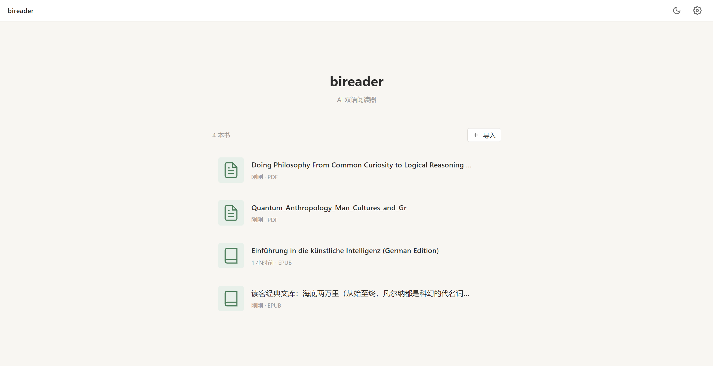
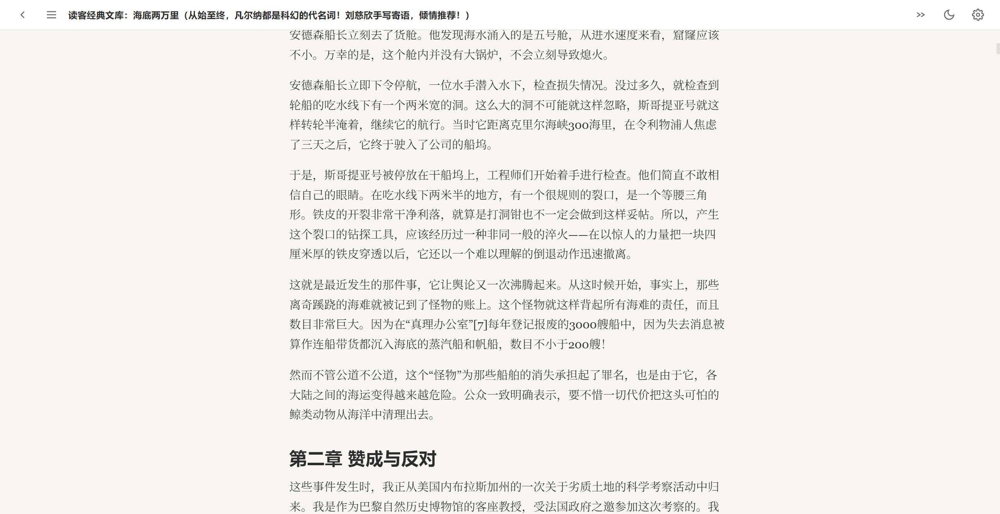
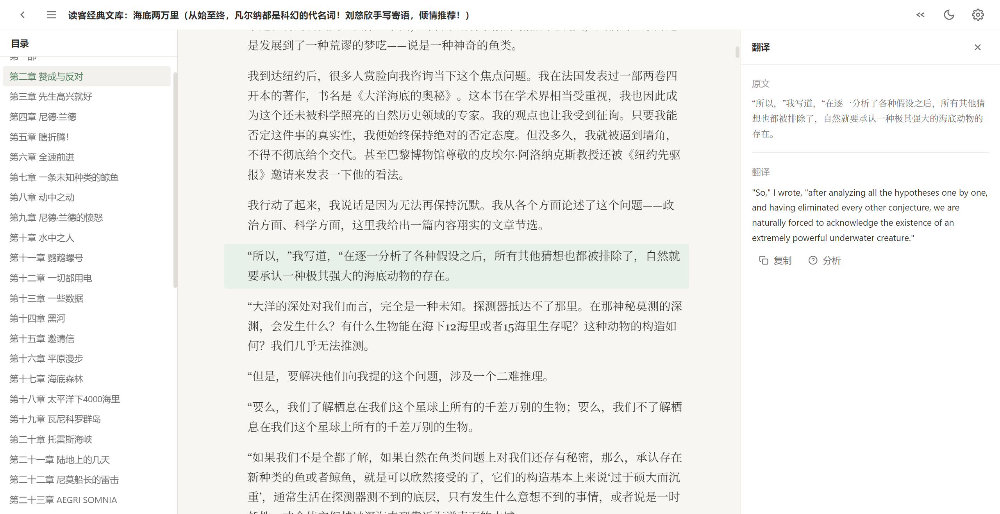
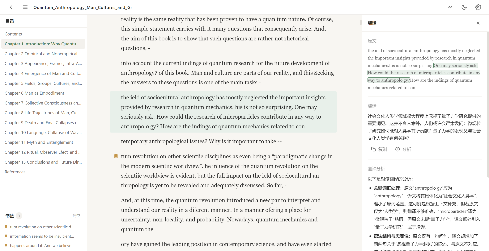
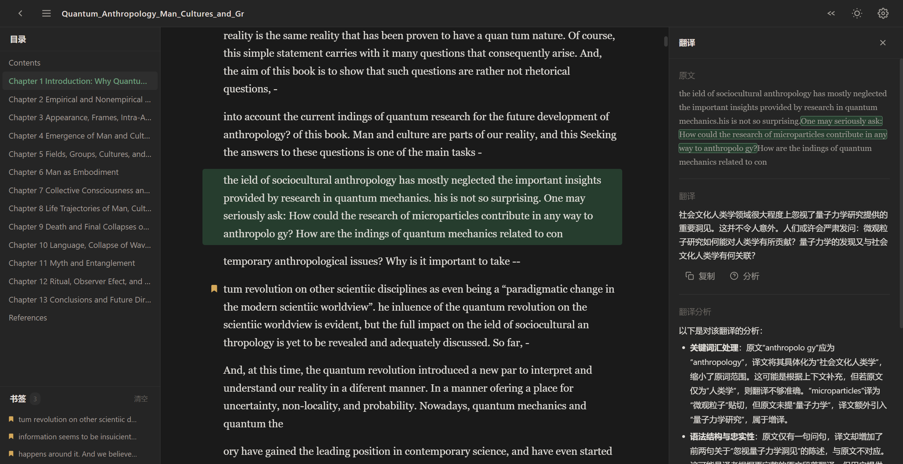

# bireader

AI 双语阅读器，基于 Electron + Vue3 + TypeScript 构建。支持导入 EPUB 电子书，借助 AI 实时翻译，提供流畅的双语阅读体验。

## 功能

- **EPUB 导入** — 支持导入 EPUB 格式电子书，自动解析目录和正文
- **AI 翻译** — 点击段落或选中文本即可翻译，支持 DeepSeek / OpenAI / Claude 等多提供商
- **三栏布局** — 目录栏 + 阅读区 + 翻译栏，左右侧栏可折叠，翻译栏宽度可拖拽
- **深色模式** — 浅色/深色主题一键切换
- **翻译缓存** — LRU 缓存避免重复请求，防抖处理减少 API 调用
- **安全设计** — API Key 仅存于主进程本地文件，渲染进程不可访问

## 快速开始

```bash
# 安装依赖（国内建议设置镜像）
ELECTRON_MIRROR=https://npmmirror.com/mirrors/electron/ npm install

# 启动开发
npm run dev

# 构建
npm run build
```

## 配置 API

启动后点击窗口右上角齿轮图标，输入 API Key、Base URL 和 Model，保存即可。配置存储在本地 `userData/config.json`，不会上传到任何地方。

| 提供商 | Base URL | Model 示例 |
|--------|----------|-----------|
| DeepSeek | `https://api.deepseek.com` | `deepseek-v4-pro` |
| OpenAI | `https://api.openai.com/v1` | `gpt-4o` |
| 自定义 | 任意兼容 OpenAI 接口的地址 | 自定义 |

## 截图

### 首页与书架


### 阅读模式


### 双侧边栏展开


### 翻译与 AI 分析


### 深色模式


## 技术栈

- **框架**: Electron + Vue3 (Composition API) + TypeScript
- **构建**: electron-vite + Vite
- **状态管理**: Pinia
- **EPUB 解析**: JSZip
- **AI SDK**: OpenAI SDK（兼容多提供商）

## 项目结构

```
src/
├── main/                # Electron 主进程
│   ├── index.ts         # 窗口创建
│   ├── ipc.ts           # IPC 通信处理
│   ├── config.ts         # 配置管理
│   ├── translator-service.ts  # 翻译服务
│   └── epub-parser.ts   # EPUB 解析
├── preload/             # 预加载脚本
│   ├── index.ts         # contextBridge API
│   └── index.d.ts       # 类型声明
└── renderer/            # Vue3 渲染进程
    └── src/
        ├── components/  # Vue 组件
        ├── composables/ # 组合式函数
        ├── stores/      # Pinia 状态
        └── services/    # 缓存等服务
```

## WSL 环境

如果使用 WSL，需安装系统依赖：

```bash
sudo apt-get install -y libnss3 libatk1.0-0 libatk-bridge2.0-0 libcups2 \
  libdrm2 libdbus-1-3 libxkbcommon0 libxcomposite1 libxdamage1 libxfixes3 \
  libxrandr2 libgbm1 libasound2
```
